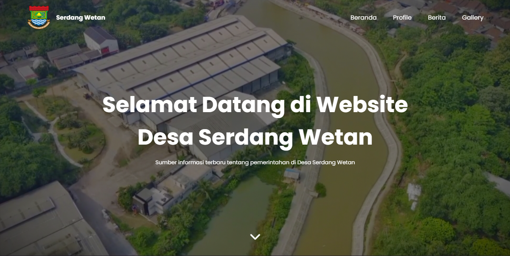

# 🌐 Website Profil Desa Serdang Wetan

Website ini merupakan **Tugas Akhir Module Dasar Pemrograman Web** dari program  
**IDCamp 2024 – React Front End Developer**.

Project ini dibangun sebagai website statis yang menyajikan informasi profil Desa Serdang Wetan, meliputi beranda, profil desa, berita terbaru, dan galeri dokumentasi kegiatan desa.

##

## 📖 Deskripsi Project

Website Profil Desa Serdang Wetan bertujuan untuk:

- Menyediakan media informasi digital bagi masyarakat
- Menampilkan potensi desa, kegiatan, dan berita terkini
- Menerapkan konsep **HTML5 semantik**, **CSS responsif**, dan **JavaScript dasar**

Project ini menjadi bentuk implementasi pembelajaran pada module **Dasar Pemrograman Web**, mencakup struktur dokumen, styling, interaksi sederhana, serta optimasi performa dasar.

##

## 📸 Screenshot



##

## 🎯 Tujuan Pembelajaran

Melalui project ini, peserta diharapkan mampu:

- Menyusun struktur website menggunakan HTML5 semantik
- Menerapkan styling menggunakan CSS eksternal
- Mengelola aset (gambar, font, icon)
- Mengimplementasikan interaksi dasar menggunakan JavaScript
- Menggunakan library eksternal untuk animasi dan ikon
- Membuat website informatif yang responsif dan user-friendly

##

## ✨ Fitur Utama

- ✅ Navigasi responsif (hamburger menu)
- ✅ Hero section informatif
- ✅ Section profil desa dengan video YouTube embed
- ✅ Section berita dengan artikel dan external link
- ✅ Galeri foto interaktif dengan overlay
- ✅ Animasi scroll menggunakan **ScrollReveal.js**
- ✅ Ikon menggunakan **Font Awesome**
- ✅ Lazy loading untuk optimasi gambar
- ✅ Desain modern dan bersih

##

## 🛠️ Teknologi yang Digunakan

- **HTML5**
- **CSS3**
- **JavaScript (Vanilla JS)**
- **Font Awesome**
- **ScrollReveal.js**

##

## 📂 Struktur Folder

```text
│
├── index.html
├── assets/
│ ├── css/
│ │ └── style.css
│ ├── js/
│ │ └── main.js
│ └── img/
│ ├── hero.jpg
│ ├── sertifikasi.jpg
│ ├── pengabdian.jpg
│ ├── gallery images
│ └── logo-tangkab.png
```

##

## 👨‍💻 Author

**Ibnu Nurdiyansa**
Peserta **IDCamp 2024 – React Front End Developer**
